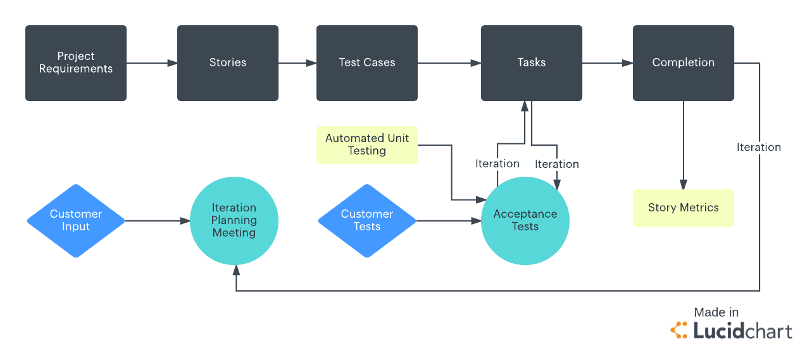
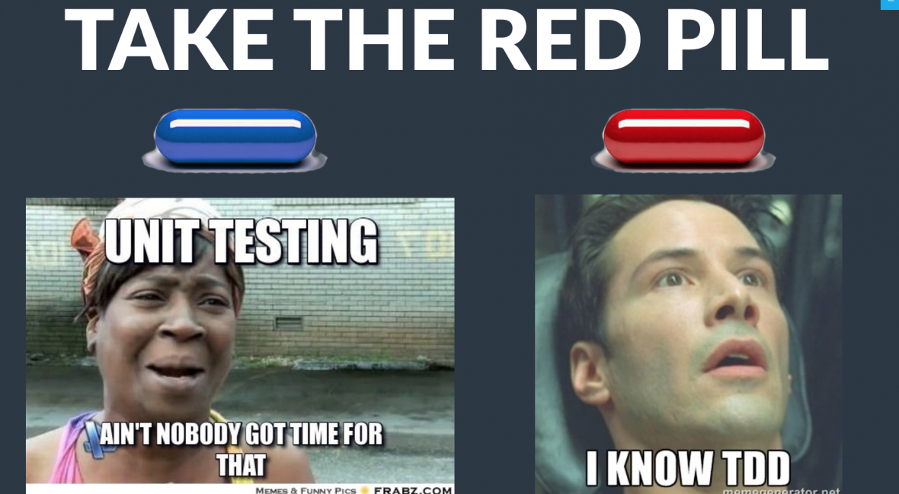

### Objectives
YWBAT 
* explain how TDD is used within AGILE
    * Agile vs Waterfall
* write a function given test requirements
* execute a nosetest to verify if your function passes or fails

### What is Agile?
> *Agile project management is an iterative development methodology that values human communication and feedback, adapting to changes, and producing working results.*  - https://blog.capterra.com/definition-of-agile-project-management/

[Full Agile Manifesto Here](http://agilemanifesto.org/principles.html)

### AGILE DIAGRAM


Since we're only dealing with the **Tasks** section of this diagram, let's see how **TDD** fits into it


### Why TDD?


### Let's go through an example
After the sprint planning meeting on Wednesday morning, you've been tasked with the following requirements. Add to the source code functionality that will:
* New user signs up on site with email and password
* App will verify that the password has
    * at least 15 characters
    * at least one character is a digit
    * at least one character is a special symbol (?!@#\$\*)
    * at least one character is uppercase

### Common Best Practices
* Use IDE that supports a terminal
    * PyCharm (preferred for python developers)
    * VSCode
* Split windows to view both files at the same time
* Run nosetests within a folder
    * ```nosetests unittest/```
* Run nosetests to break after first fail
    * ```nosetests unittest/ -x```

### [Full Nosetest Docs Found Here](https://nose.readthedocs.io/en/latest/man.html)
